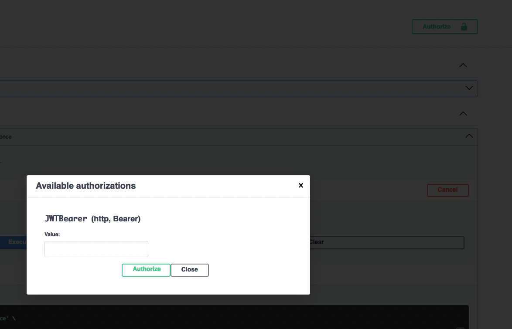
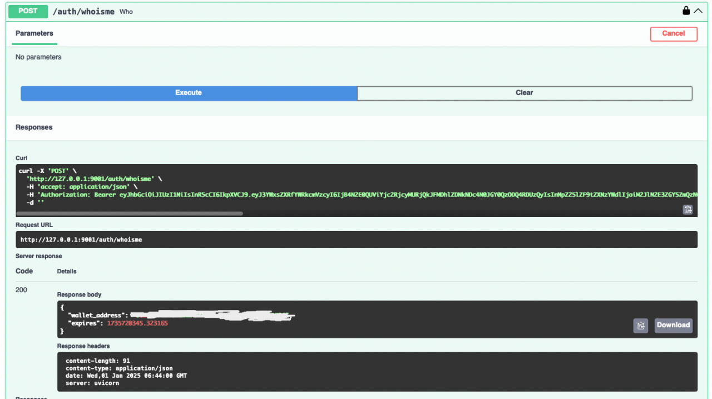

# DAO Management Backend

## Environment

1. `Python 3.12.1`
2. [FastAPI cli](https://fastapi.tiangolo.com/fastapi-cli/)

## Setup Instructions

1. Clone the Repository

```
$ git clone https://github.com/coreyjj1679/dao-fastapi
$ cd dao-fastapi
```

2. Setup venv

```
$ python3 -m venv venv
$ source venv/bin/activate
```

3. Install dependencies

```
$ pip install -r requirements.txt
```

## Local development

```
$ fastapi dev app/main.py --port <PORT_NUMBER>
```

## Test

```
$ pytest app/tests/**.py
```

## Sign message

```
python3 sign.py <NONCE>
```

## API Specifications

- [Docs](./Endpoint.md)

## Demo

1. Start FastAPI server

```
$ fastapi dev app/main.py --port <PORT_NUMBER>


> server   Server started at http://127.0.0.1:<PORT_NUMBER>
> server   Documentation at http://127.0.0.1:<PORT_NUMBER>/docs
```

2. Request nonce from `/auth/request-nonce`
3. Sign with `sign.py`

```
$ python3 sign.py <NONCE>

> Signing message...
> wallet_address: <WALLET_ADDRESS>
> message to be signed:  <NONCE>
> Message signed.
> Signature: 34f0ad1dbf7d9eff752211ac41abcf9d2fb30a052eceaa1aaa7ab9007f957ee03d66abb1a359d2ecbff1189b00aa7590fbbc645f359510d2b3e1d8f38ddbab8b1b
```

4. Login with the `auth/login` endpoint
5. Click the `Authorize` button at the top right corner on Swagger, input the token and authorize.

   

6. Check the status and expires with the `/auth/whoisme` endpoint.

   

7. Start voting!
